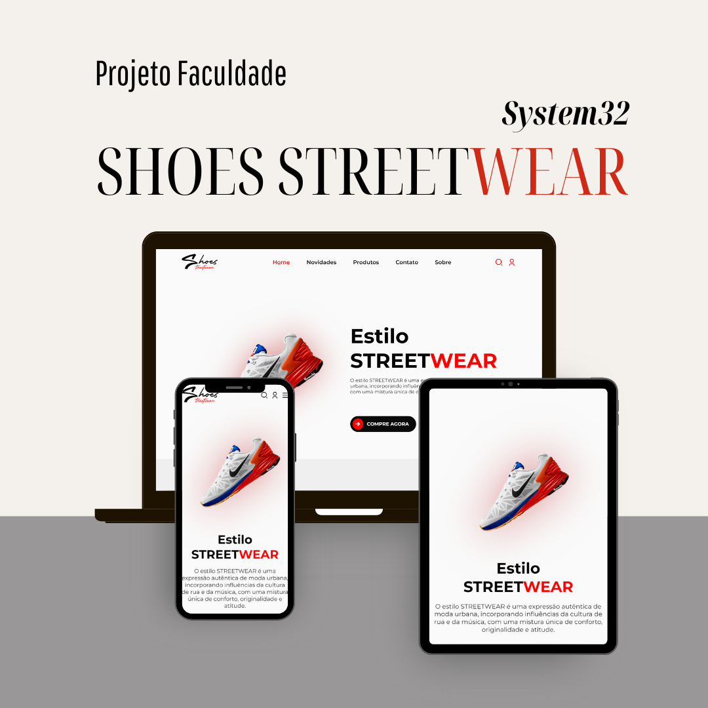

# Shoes StreetWear: Projeto E-commerce para Faculdade

[SHOES STREETWEAR](https://hub-moraes.github.io/Projeto.E-commerce/) Este é um projeto de uma loja e-commerce de calçados voltados para o público da moda StreetWear. Nosso objetivo foi desenvolver uma plataforma fácil e intuitiva. Com um sistema focado para atender consumidores mais jovens que se importam com um bom layout e uma experiência agradável.

<h4 align="center"><a href="https://hub-moraes.github.io/Projeto.E-commerce/">Clique para visitar o projeto</a></h4>

## Técnologias Utilizadas ##

* Design UX e UI
* Figma
* HTML
* CSS
* Javascript
